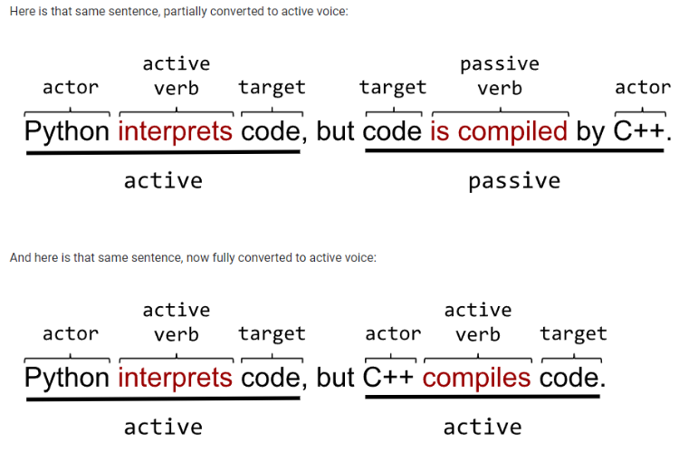

# Google Tech Writer

### Gramática

###### Uma definição básica de conceitos gramaticais importantes de se ter ao escrever uma documentação:

- **Substantivos** são nomes, coisas ou lugares, abstrações em palavras:
  > **João** joga **basquete**
- **Pronomes** substituem substantivos ou sentenças:
  > João pratica esportes. **Ele** gosta de basquete
- **Adjetivo** é uma palavra ou frase que modifica um substantivo:
  > João tem um tênis **branco**
- **Verbo** é um palavra ou frase que representa uma ação:
  > João **gosta** de **jogar** video-games
- **Advérbio** é uma palavra ou frase que modifica um verbo:

  > João prefere andar **rapidamente**

### Termos

###### Definindo termos novos ou não usuais

Para saber como inserir termos adequadamente em sua documentação, existem duas regras que na maioria das vezes será um bom indicativo de como trabalhá-los:

- Se o termo **já existe**, tente conectá-lo à uma explicação já consolidada.
- Se você está **criando** o termo, defina-o bem e caso sejam vários termos crie um **glossário**.

###### Uso consistente

Se você definiu um termo com um nome no início mantenha o mesmo nome até o final:

> O uso de **métodos** em Vue.js é bem regular. Os desenvolvedores tendem a utilizar várias ~~funções~~ durante o desenvolvimento.

Ainda que as palavras sejam sinônimos, o aconselhado é manter o **padrão** dos termos durante toda a documentação. Entretanto, há uma maneira de **alterar** termos de forma responsável em seu texto, indicando logo ao **início** que você utilizará uma segunda palavra para se referir ao termo:

> O uso de **métodos ou funções** em Vue.js é bem regular. Os desenvolvedores tendem a utilizar várias funções durante o desenvolvimento.

###### Utilizando acrônimos

Acrônimos são perfeitos para substituir termos com nomes longos, entretanto, existem algumas indicações para o seu uso:

- Não utilize acrônimos se o termo **não for recorrente** em sua documentação.
- Utilize acrônimos quando o termo for significativamente **menor** que o termo inteiro e apareça **várias** vezes durante o documento.
- Defina o acrônimo juntamente com o termo por extenso na primeira aparição dele no documento.
  > Vue.js é um framework importante de Javascript **(JS)** no desenvolvimento WEB

### Voz ativa

A voz ativa é composta pela seguinte estrutura:

> Voz ativa = ator + verbo + alvo  
> O **gato comeu** a **ração**

Enquanto a voz passiva é o inverso:

> Voz passiva = alvo + verbo + ator  
> A **ração** foi **comida** pelo **gato**

Sempre opte por utilizar voz ativa na redação da sua documentação, saiba identificar as duas estruturas:

### Sentenças claras

A clareza do seu texto deve sempre ser sua **prioridade**, para isso algumas práticas podem ajudar a fazer a documentação ficar mais clara para os leitores:

- Reduzir o uso de **adjetivos e advérbios**, pois o uso deles pode acabar dando um sentido mais **midiático** do que técnico, fugindo ao objetivo de uma documentação técnica responsável.
- Fugir de verbos e sentenças **genéricas/fracas**, como o uso excessivo de **“tem um”** e outros subterfúgios de linguagem.

### Construção resumida

Um bom escritor técnico vai sempre tentar buscar produzir uma documentação mais **resumida** possível pois uma documentação **concisa** traz alguns benefícios, sendo estes:

- Documentação resumida é lida mais **rapidamente**
- Documentação resumida é normalmente mais **fácil de manter**
- Quanto mais longa sua documentação mais **chances de erro** o editor assume

Uma ideia resumida e clara sempre vai ser mais fácil de se entender do que algo complexo e prolixo. Cada sentença deve ser responsável por uma ideia só. No exemplo abaixo você vê como a separação de sentenças é crucial para uma escrita objetiva:

> O final da década de 50 foi crucial para as linguagens de programação porque a IBM criou o Fortran em 1957 e John McCarthy surgiu com Lisp no ano seguinte, o que acabou dando aos programadores maneiras iterativas e recursivas de se resolver um problema

> O final da década de 50 foi crucial para as linguagens de programação. A IBM criou o Fortran em 1957. John McCarthy criou o Lisp no ano seguinte. Tudo isso colaborou para que os programadores tivessem maneiras iterativas e recursivas de resolver um problema.
> 

No primeiro exemplo todas as ideias são inseridas em uma só sentença, fazendo com que o leitor tenha mais dificuldade de absorver a ideia. Já na correção as ideias são separadas em sentenças únicas e ao final vem a conclusão do pensamento. Tenha sempre em mente: **uma sentença, uma ideia**.

**Redundâncias** também não são bem-vindas em um bom texto técnico, uma documentação mais concisa pode ser feita excluindo palavras ou frases que retratam uma ideia **já elaborada** anteriormente. Tente eliminá-las de seu texto.

### Listas e tabelas

Listas e tabelas são ótimas para **organizar** as ideias em uma documentação. Listas podem ser de grande ajuda em sentenças que poderiam ser **numeradas**. Sempre que sua sentença possuir um **ou** considere se ela não poderia ser traduzida em uma lista.

Listas possuem 2 tipos mais utilizados em uma boa documentação:

- Listas com **marcadores**
- Listas **numeradas**

Listas com marcadores são utilizadas quando a **ordem** dos itens **não interfere** no entendimento:

> Ingredientes de uma lasanha
>
> - Macarrão
> - Molho de tomate
> - Carne
> - Queijo

Listas numeradas são utilizadas quando a **ordem** dos itens **é importante**:

> Como fazer uma lasanha
>
> 1. Aqueça a água.
> 2. Tempere a carne.
> 3. Coloque a massa para ferver.

Listas efetivas são **paralelas**. E o que é uma lista paralela? É uma lista que segue alguns paramÊtros:

- Gramática, segue uma boa gramática na **escrita** de seus itens.
- Categorização lógica, os itens da lista pertencem a um **mesmo grupo lógico**.
- Capitalização, as **iniciais** de cada item seguem um padrão de **maiúsculas ou minúsculas**.
- Pontuação, a pontuação **final** de cada item segue o **padrão** da lista utilizando vírgula, ponto final ou nenhuma pontuação.

Listas numeradas tendem a ser iniciadas de forma **imperativa**:

> 1. **Baixe** o aplicativo X em nosso site.
> 2. **Instale** o aplicativo em sua máquina.
> 3. **Configure** o seu ambiente.
> 4. **Inicie** o aplicativo

A capitalização e pontuação de itens não possui uma **regra explícita**, mas o guia de documentação do **Google** possui algumas boas práticas:

- Caso o item seja uma **frase** finalize-o com ponto final.
- Se for um termo ou palavra qualquer deixe **sem pontuação**.
- Sempre inicie os itens com **maiúsculas**.

Utilize tabelas para chamar a **atenção** do leitor com informações que **podem ser bem representadas** com as colunas e linhas de uma tabela. Considere os seguintes pontos quando fizer sua tabela:

- Nomeie cada coluna com um bom **título**.
- Evite **muito texto** nas células. Se a tabela está com muito conteúdo considere **outro formato** para expor a informação.
- Busque a **paralelização** de sua tabela assim como nas listas.

Sempre introduza a lista ou tabela que você inserir em sua documentação, não jogue a informação sem uma descrição resumida do que vai ser exposto ao leitor.

### Parágrafos

A **primeira** sentença do seu parágrafo é a mais importante. Ela quem vai **cativar** o leitor a continuar lendo o restante do seu desenvolvimento. Foque sempre em construir **boas aberturas** de parágrafos.

Evite parágrafos muito **longos ou curtos**. Parágrafos com muitas sentenças tendem a ser **cansativos** e parágrafos muito curtos deixam a sua documentação **desorganizada**, busque sempre o meio-termo. Sempre que for criar um parágrafo tenha os seguintes questionamentos em mente:

- **O que** você está tentando **dizer** ao seu leitor?
- **Por que** isso é **importante** para o leitor?
- **Como** o leitor vai **utilizar** este conhecimento?

### Público

O público para **quem** a documentação se destina é que vai ditar como essa documentação será pensada. Defina qual a **atribuição geral** das pessoas que irão ler o seu documento, se são desenvolvedores, estudantes, cientistas, entre outros. Pois pessoas com a **mesma** atribuição tendem a possuir a mesma base de conhecimento.

Tenha em mente quais são os conhecimentos mais **prováveis** de seu público ter. Com essa informação em mãos alguns pontos podem ser **ignorados**. Por exemplo, se o seu público é de desenvolvedores **C#** mas o seu projeto foi feito em **Java**, você não precisa abordar conhecimentos de Programação Orientada a Objetos pois você **espera** que seu público já o possua.

Isso faz com que sua documentação fique mais **concisa, clara** e **coerente** com os leitores. O seu público irá definir se alguns termos ou conceitos serão **explicados**, **revisitados** ou **ignorados**. Tudo isso com base no **conhecimento geral** dos leitores.

### Escopo e requisitos da documentação

Defina o que a sua documentação se propõe a explicar e o que não.

> Esta documentação visa explicar os conceitos X, Y e Z do Projeto A. Este documento não irá abordar como a funcionalidade B do Projeto A funciona.

Sumarize os pontos chave logo no início do documento. Tendo os principais pontos da sua documentação explicitados logo no início impele o leitor a continuar a leitura. Isso faz com que o usuário saiba se sua dúvida será respondida ou não.

Defina os requisitos esperados de sua audiência para entender sua documentação.

> É esperado que o usuário já possua prévio conhecimento em algoritmos de programação e linguagens orientadas a objetos

Forneça ao seu público o conhecimento ou atalho necessário para fluir melhor durante do desenvolvimento da documentação. Utilize comparações com projetos, conceitos ou termos já existentes para facilitar o entendimento.

> Este conceito X é muito semelhante ao que ocorre no Projeto C, onde você pode conferir sua documentação em: www.link.com
